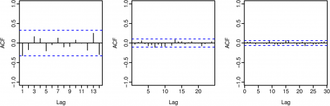

```{r include=FALSE}
# Init
library(fma)
library(fpp)
library(caret)
library(mlbench)

# Display options
library(knitr)
opts_chunk$set(tidy=TRUE)
opts_chunk$set(tidy.opts=list(width.cutoff=50))

# Random seed (using 200 since everyone seems to use it, makes results more comparable)
set.seed(200)

# Data Imports
data(ibmclose)
data(wmurders)
data(usmelec)
```

\pagebreak

## Question 8.1

Figure 8.24 shows the ACFs for 36 random numbers, 360 random numbers and for 1,000 random numbers.




a) Explain the differences among these figures. Do they all indicate the data are white noise?
b) Why are the critical values at different distances from the mean of zero? Why are the autocorrelations different in each figure when they each refer to white noise? 

**Answer**: The differences between those figures are where the critical values are plotted and the location of the spikes at certain lags. From the textbook: 

>"For a white noise series, we expect 95% of the spikes in the ACF to lie within $+- 2/\sqrt{T}$ >where $T$ is the length of the time series. It is common to plot these bounds on a graph of the >ACF. If there are one or more large spikes outside these bounds, or if more than 5% of spikes >are outside these bounds, then the series is probably not white noise". 

As we can see, all the above plots are white noise as none of the lags show a spike that goes outside those bounds. For white noise, you would expect that there would be *no* correlation at any lag, but simply due to random variance, there will be some small correlations but this explains why the spikes would not appear at the same lag values for different white noise time series.

\pagebreak

## Question 8.2

A classic example of a non-stationary series is the daily closing IBM stock prices (data set ibmclose). Use R to plot the daily closing prices for IBM stock and the ACF and PACF. Explain how each plot shows the series is non-stationary and should be differenced. 

**Answer:** Lets first plot the time series and the associated ACF / PACF plots:

```{r}
#plot(ibmclose, main="IBM Closing Prices", ylab="Closing Price")
tsdisplay(ibmclose,main="IBM Closing Prices")
```

From the book: 

>"For a stationary time series, the ACF will drop to zero relatively quickly, while the ACF of
>non-stationary data decreases slowly""

The ACF is not dropping to zero quickly, which insinuates that this is non-stationary. The PACF plot shows a significant spike at lag = 1, which also insinuates that an AR(1) term is needed. Since the lag value is close to one, that means the coefficient of the AR(1) term would be one, which is equivalent of doing at least one differencing:

```{r}
tsdisplay(diff(ibmclose),main="IBM Closing Prices")
```

After doing one difference, the ACF / PACF plots are looking closer to white noise. There are still some spikes going past the critical value, but doing an auto.arima call on the differenced ibmclose data gives a result of ARIMA(0,0,0), which is white noise.

\pagebreak

## Question 8.6

Consider the number of women murdered each year (per 100,000 standard population) in the United States (data set wmurders).

a) By studying appropriate graphs of the series in R, find an appropriate ARIMA(p,d,q) model for these data.

**Answer:** Lets use unit root tests to see if the data needs to be differences:

```{r}
adf.test(wmurders, alternative = "stationary")  # 0.9878
```

Large p-values are indicative of non-stationarity, so lets see how many differences we can do to get the unit root test to show stationarity:

```{r results='hold'}
adf.test(diff(wmurders), alternative = "stationary") # 0.02726
adf.test(diff(wmurders, differences=2), alternative = "stationary")
```

Ok, so we should take two differences (i.e., $d$ = 2). Lets look at the ACF / PACF graphs after transforming that data:

```{r}
tsdisplay(diff(wmurders, differences=2), main="Women Murdered in the US (per 100,000)", ylab="Women Murderd (per 100,000)")
```

Looking at the PACF plot, we see a single spike at lag = 1, and the ACF plot also has a spike at lag = 1 and 2. From this, I would assume that $p = 1$ and $q = 2$.

b) Should you include a constant in the model? Explain.

**Answer:** A constant is not needed. A constant in the AR and ARIMA models allows for drift or trend, neither of which seem present in the data.

c) Write this model in terms of the backshift operator.

**Answer:** $(1- \phi_{1}B)(1-B)y_{t} = c + (1 + \theta_{1}B + \theta_{2}B^2)e_t$

d) Fit the model using R and examine the residuals. Is the model satisfactory?

```{r}
wmurders.model <- Arima(wmurders, order=c(1,2,2))
summary(wmurders.model)
tsdisplay(resid(wmurders.model), main="Arima(1,2,2) Model")
```

The model is satisfactory as the ACF / PACF plots show that the residuals are white noise. However, the residuals are showing an increasing variance, which means that there might be a better model.

e) Forecast three times ahead. Check your forecasts by hand to make sure you know how they have been calculated.

**Answer:** Here are the forecasts:

```{r}
wmurders.forecast <- forecast(wmurders.model, h=3)
wmurders.forecast
```

TODO: Lets calculate the forecasts

f) Create a plot of the series with forecasts and prediction intervals for the next three periods shown.

```{r}
plot(wmurders.forecast)
```

g) Does auto.arima give the same model you have chosen? If not, which model do you think is better? 

```{r}
wmurders.automodel <- auto.arima(wmurders, seasonal=FALSE)
wmurders.automodel
```

Looks like the auto.arima() function comes up with a different model, namely ARIMA(1,2,1) which is close to the model above. Actually, the algorithm outlines in the book would have had us look at this model as an alternative. The automodel is better in terms of $AIC$, $AICc$, and $BIC$.

Lets comparse forecasts:

```{r}
plot(wmurders, xlim=c(1950, 2008), main="Forecasts from ARIMA Models of\nWomen Murdered in the US (per 100,000) ")
lines(forecast(wmurders.model, h=3)$mean, col="red", type="o")
lines(forecast(wmurders.automodel, h=3)$mean, col="blue", type="o")
legend(1975, 3.0, c("ARIMA(1,2,2)", "ARIMA(1,2,1)"), lty=c(1,1), lwd=c(2.5, 2.5), col=c("blue","red"))
```

\pagebreak

## Question 8.8

Consider the total net generation of electricity (in billion kilowatt hours) by the U.S. electric industry (monthly for the period 1985–1996). (Data set usmelec.) In general there are two peaks per year: in mid-summer and mid-winter.

a) Examine the 12-month moving average of this series to see what kind of trend is involved.

```{r}
plot(usmelec, main="Total Net Generation of Electricity \n(in billion kilowatt hours, monthly during 1985–1996)", ylab="Electricity (in billion kilowatt hours)")
lines(ma(x = usmelec, order = 12), col="red")
```

b) Do the data need transforming? If so, find a suitable transformation.

It seems like the data does need transforming, as the variance seems to increase with time (which indicates a seasonal component that grows in time). Lets use a BoxCox transform and follow it with a seasonal transform (by using a diff with a 12m lag):

```{r}
lambda <- BoxCox.lambda(usmelec) 
usmelec.boxcox <- BoxCox(usmelec, lambda)
plot(usmelec.boxcox, main="Total Net Generation of Electricity \n(in billion kilowatt hours, monthly during 1985–1996)", ylab="Electricity (in billion kilowatt hours)")

usmelec.seasadj <- diff(usmelec.boxcox, 12)
tsdisplay(usmelec.seasadj, main="Total Net Generation of Electricity\nBoxCox + Seas Adj ", ylab="Electricity (in billion kilowatt hours)")

```

c) Are the data stationary? If not, find an appropriate differencing which yields stationary data

Using both tests, I get mixed results:

```{r warning=FALSE}
# Mixed results
adf.test(usmelec.seasadj, alternative = "stationary")$p.value
kpss.test(usmelec.seasadj)

# One more difference
adf.test(diff(usmelec.seasadj, differences=1), alternative = "stationary")$p.value
kpss.test(diff(usmelec.seasadj, differences=1))

# Seems like to get both tests to confirm stationarity, we need to diff once more
usmelec.adj <- diff(usmelec.seasadj, differences=1)

# Plot final data set
tsdisplay(usmelec.adj, main="Total Net Generation of Electricity\nBoxCox + Seas Adj + 1 difference", ylab="Electricity (in billion kilowatt hours)")
```

d) Identify a couple of ARIMA models that might be useful in describing the time series. Which of your models is the best according to their AIC values?

I find these ACF / PACF plots somewhat difficult to interpret, as if its some kind of black magic, esp when dealing with seasonal ARIMA models. This plot doesn't seem to fit exactly in the rules of thumb given in the book. The PACF does show spikes at every 12th lag, with them slightly decaying, while the ACF shows one spike at lag = 12. This seems to indicate a $(0,1,1)_12$ seasonal component, w/ $d=1$ since we did a seasonal difference and $m=12$ since the seasonal period is 12 months.

The non-seasonal component is also tough to interpret from the graphs. I think d should still be 1 due to the one differencing we needed. For this part, I'll use a few simple non-seasonal components and see what AIC values I get:

```{r}
arima.fit1 <- Arima(usmelec.boxcox, order=c(0,1,1), seasonal=c(0,1,1))
summary(arima.fit1)

arima.fit2 <- Arima(usmelec.boxcox, order=c(1,1,0), seasonal=c(0,1,1))
summary(arima.fit2)

arima.fit3 <- Arima(usmelec.boxcox, order=c(1,1,1), seasonal=c(0,1,1))
summary(arima.fit3)

```

Seems like fit3 is the best with the lowest $AIC_c$.

e) Estimate the parameters of your best model and do diagnostic testing on the residuals. Do the 
residuals resemble white noise? If not, try to find another ARIMA model which fits better.

```{r}
tsdisplay(residuals(arima.fit3))
```

This looks close to white noise, but not quite close enough. However, looking at the results of auto.arima(), we do not see white noise either:

```{r}
arima.fitauto <- auto.arima(usmelec.boxcox)
tsdisplay(residuals(arima.fitauto))
```

It might not be possible to get white noise in the residuals using these techniques.

f) Forecast the next 15 years of generation of electricity by the U.S. electric industry. Get the latest figures from http://data.is/zgRWCO to check on the accuracy of your forecasts.

Forecasting from my best model:

```{r}
arima.fitauto.forecast <- forecast(arima.fitauto, h=180)
plot(arima.fitauto.forecast)
```

Forecasting from auto.arima():

```{r}
arima.fit3.forecast <- forecast(arima.fit3, h=180)
plot(arima.fit3.forecast)
```

Not sure why the auto.arima forecast gets out whack after 4 years or so. Further analysis will be on my model's forecast. The forecasts from my model look ok but I think trends too far upwards.

h) How many years of forecasts do you think are sufficiently accurate to be usable? 

From the plot, it looks like the range of values from starts to expand after 4 years from a visual inspection. I imagine forecasting more than 5 years are so is going to be quite off if looking for exact values from the prediction. Forecasts further than might be useful for future trend analysis.